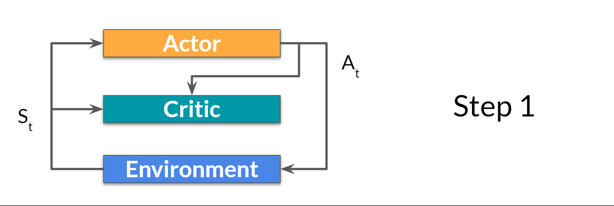
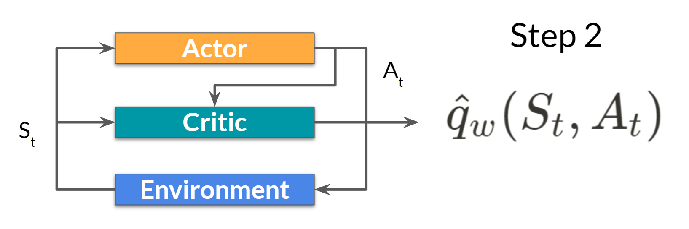
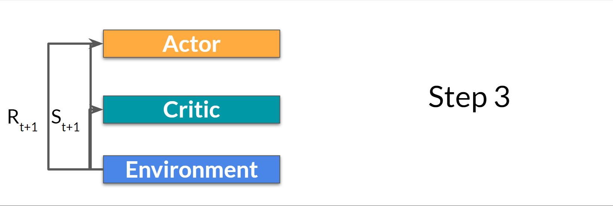
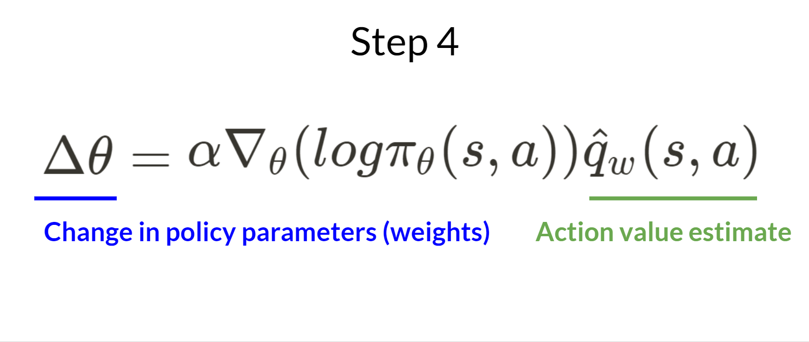
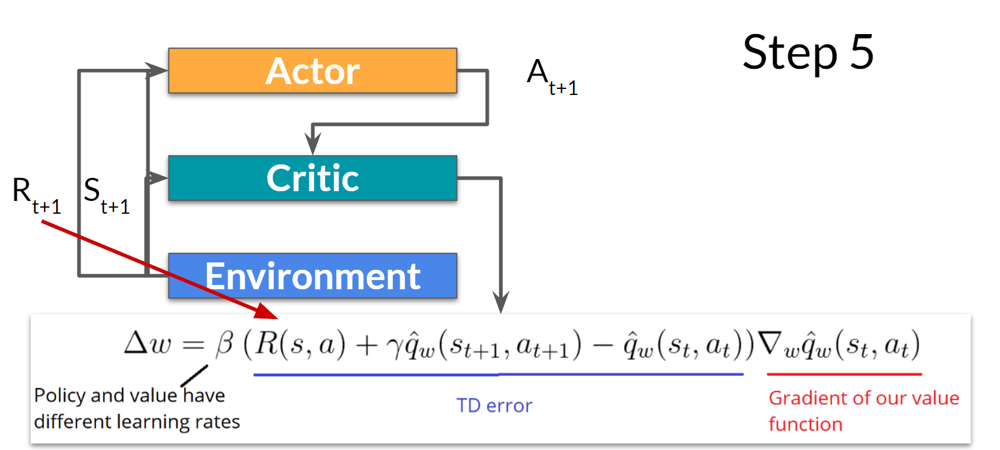

# The Actor-Critic Process

Now that we have seen the Actor Critic's big picture, let's dive deeper to understand how the Actor and Critic improve together during the training. As we saw, with Actor-Critic methods, there are two function approximations (two neural networks):

* _Actor_, a **policy function** parameterized by theta: $$\pi_\theta (s)$$
* _Critic_, a **value function** parameterized by w: $$\hat{q}_w(s,a)$$

Let’s see the training process to understand how the Actor and Critic are optimized:

## Step 1:

At each timestep, $$t$$, we get the current state $$S_t$$ from the environment and **pass it as input through our Actor and Critic**.

Our Policy takes the state and **outputs an action** $$A_t$$ ​.

<figure><figcaption></figcaption></figure>

## Step 2:

The Critic takes that action also as input and, using $$S_t$$ and $$A_t$$ **computes the value of taking that action at that state: the Q-value**.

<figure><figcaption></figcaption></figure>

## Step 3:

The action $$A_t$$ performed in the environment outputs a new state $$S_{t+1}$$​ and a reward $$R_{t+1}$$

<figure><figcaption></figcaption></figure>

## Step 4:

The Actor updates its policy parameters using the Q-value.

<figure><figcaption></figcaption></figure>

## Step 5:

Thanks to its updated parameters, the Actor produces the next action to take at $$A_{t+1}$$​ given the new state $$S_{t+1}$$​.

The Critic then updates its value parameters.

<figure><figcaption></figcaption></figure>
