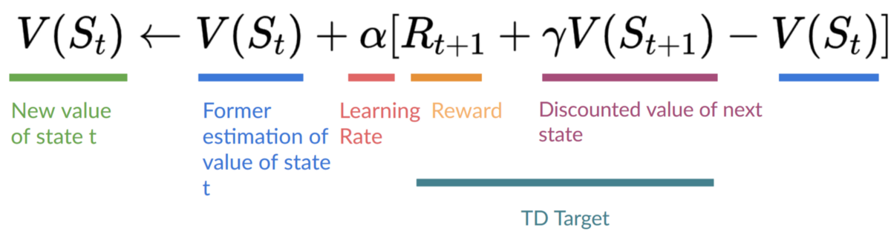

# Double DQN

###

Double DQNs, or Double Deep Q-Learning neural networks, were introduced [by Hado van Hasselt.](https://papers.nips.cc/paper/3964-double-q-learning) This method **handles the problem of the overestimation of Q-values.**

<figure><figcaption></figcaption></figure>


When calculating the TD Target, we face a simple problem: how are we sure that **the best action for the next state is the action with the highest Q-value?**


We know that the accuracy of Q-values depends on what action we tried **and** what neighboring states we explored.

Consequently, we don’t have enough information about the best action to take at the beginning of the training. Therefore, taking the maximum Q-value (which is noisy) as the best action to take can lead to false positives. If non-optimal actions are regularly **given a higher Q value than the optimal best action, the learning will be complicated.**

The solution is: when we compute the Q target, we use two networks to decouple the action selection from the target Q-value generation. We:

* Use our **DQN network** to select the best action to take for the next state (the action with the highest Q-value).
* Use our **Target network** to calculate the target Q-value of taking that action at the next state.

Therefore, Double DQN helps us reduce the overestimation of Q-values and, as a consequence, helps us train faster and with more stable learning.
