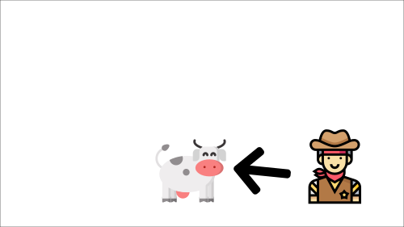

# Fixed Q-Target

When we want to calculate the TD error (aka the loss), we calculate the **difference between the TD target (Q-Target) and the current Q-value (estimation of Q)**.

But we **don’t have any idea of the real TD target**. We need to estimate it. Using the Bellman equation, we saw that the TD target is just the reward of taking that action at that state plus the discounted highest Q value for the next state.

### Q-Target

<figure><figcaption></figcaption></figure>

### Q-Loss

<figure><figcaption></figcaption></figure>

However, the problem is that we are using the same parameters (weights) for estimating the TD target **and** the Q-value. Consequently, there is a significant correlation between the TD target and the parameters we are changing.

Therefore, at every step of training, **both our Q-values and the target values shift.** We’re getting closer to our target, but the target is also moving. It’s like chasing a moving target!

This can lead to significant oscillation in training.

***

It’s like if you were a cowboy (the Q estimation) and you wanted to catch a cow (the Q-target). Your goal is to get closer (reduce the error).

<figure><figcaption></figcaption></figure>

At each time step, you’re trying to approach the cow, which also moves at each time step (because you use the same parameters).

<figure><figcaption></figcaption></figure>

<figure><figcaption></figcaption></figure>

This leads to a bizarre path of chasing (a significant oscillation in training).

<figure><figcaption></figcaption></figure>

Instead, what we see in the pseudo-code is that we:

> * Use a **separate network with fixed parameters** for estimating the TD Target
> * **Copy the parameters from our Deep Q-Network every C steps** to update the target network.
