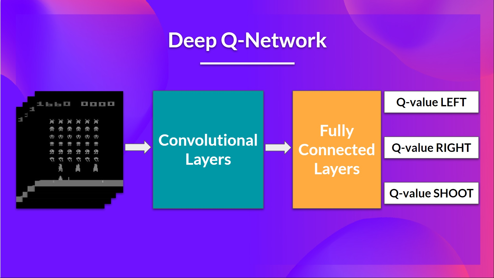

# The Deep Q-Network (DQN)

This is the architecture of our Deep Q-Learning network:

<figure><figcaption></figcaption></figure>

> As input, we take a **stack of 4 frames** passed through the network as a state and output a **vector of Q-values for each possible action at that state**. Then, like with Q-Learning, we just need to use our epsilon-greedy policy to select which action to take.

When the Neural Network is initialized, **the Q-value estimation is terrible**. But during training, our Deep QNetwork agent will associate a situation with the appropriate action and **learn to play the game well**.

Then the stacked frames are processed by three convolutional layers. These layers **allow us to capture and exploit spatial relationships in images**.

Finally, we have a couple of fully connected layers that output a Q-value for each possible action at that state.


So, the Deep Q-Learning uses a neural network to **approximate**, given a state, **the different Q-values for each possible action at that state**.


***

## **Preprocessing the input and temporal limitation:**

We need to **preprocess the input**. It’s an essential step since we want to **reduce the complexity of our state to reduce the computation time needed for training**.

1. To achieve this, we **reduce the state space to 84x84 and grayscale it**. This is a big improvement since we **reduce our three color channels (RGB) to 1**.
2. We can also **crop a part of the screen in some games** if it does not contain important information. Then we stack four frames together.

**Why do we stack four frames together?** We stack frames together because it helps us **handle the problem of temporal limitation**.&#x20;

Let’s take an example with the game of Pong. When you see this frame:

<figure><figcaption></figcaption></figure>

Can you tell me where the ball is going?&#x20;

#### No, _because one frame is not enough to have a sense of motion!_

But what if I add three more frames? **Here you can see** ball is going? Here, you can see **that the ball is going to the right**.

<figure><figcaption></figcaption></figure>
