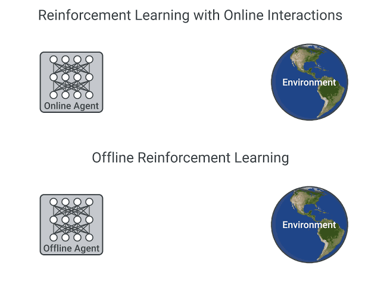

# Offline vs. Online Reinforcement Learning

Deep Reinforcement Learning (RL) is a framework **to build decision-making agents**. These agents aim to learn optimal behavior (policy) by interacting with the environment through **trial and error and receiving rewards as unique feedback**.

The agent’s goal **is to maximize its cumulative reward**, called return. Because RL is based on the _reward hypothesis_: all goals can be described as the **maximization of the expected cumulative reward**.

Deep Reinforcement Learning agents **learn with batches of experience**. The question is, how do they collect it?:

<figure><figcaption></figcaption></figure>

> In _online reinforcement learning_, which is what we’ve learned during this course, the agent **gathers data directly**: it collects a batch of experience by **interacting with the environment**. Then, it uses this experience immediately (or via some replay buffer) to learn from it (update its policy).

But this implies that either you **train your agent directly in the real world or have a simulator**. If you don’t have one, you need to build it, which can be very complex (how to reflect the complex reality of the real world in an environment?), expensive, and insecure (if the simulator has flaws that may provide a competitive advantage, the agent will exploit them).

> On the other hand, in _offline reinforcement learning_, the agent only **uses data collected from other agents or human demonstrations**. It does **not interact with the environment**.

The process is as follows:

* **Create a dataset** using one or more policies and/or human interactions.
* Run **offline RL on this dataset** to learn a policy

## **Can we develop data-driven RL methods?**

On-policy RL updates the policy while interacting with the environment, off-policy RL learns from data collected by a different behavior policy, and offline RL learns from a fixed dataset without interacting with the environment. Each approach has its own advantages and use cases depending on the specific requirements of the RL problem at hand.

<figure><figcaption></figcaption></figure>
