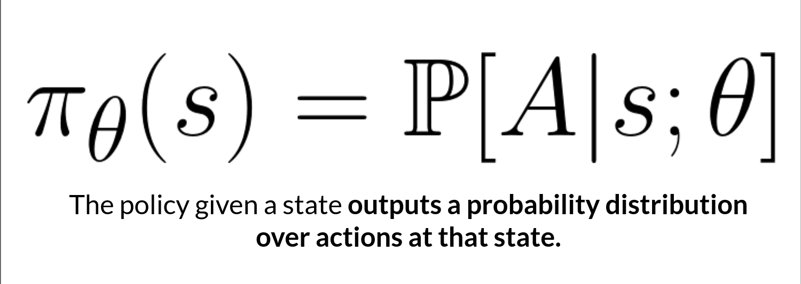

# Introducing Policy-Gradient Methods

## Recap of Policy-Based Methods

In _policy-based methods_, we directly learn to approximate π∗ without having to learn a value function.

#### The idea is **to parameterize the policy**. For instance, using a neural network πθ​, this policy will output a probability distribution over actions (stochastic policy).

<figure><figcaption></figcaption></figure>

> Our objective then is **to maximize the performance of the parameterized policy using gradient ascent**.

To do that, we control the parameter that will affect the distribution of actions over a state.

<figure><figcaption></figcaption></figure>

Consequently, thanks to policy-based methods, we can directly optimize our policy πθ​ to output a probability distribution over actions 𝜋𝜃⟮𝑎|𝑠⟯ that leads to the best cumulative return.

> To do that, we define an objective function 𝐽⟮𝜃⟯, that is, the expected cumulative reward, and we **want to find the value θ that maximizes this objective function**.

***

## The difference between policy-based and policy-gradient methods

Policy-gradient methods, what we’re going to study in this unit, is a subclass of policy-based methods. In policy-based methods, the optimization is most of the time _on-policy_ since for each update, we only use data (trajectories) collected **by our most recent version of** πθ.

The difference between these two methods **lies on how we optimize the parameter** θ:

* In _policy-based methods_, we search directly for the optimal policy. We can optimize the parameter θ **indirectly** by maximizing the local approximation of the objective function with techniques like hill climbing, simulated annealing, or evolution strategies.
* In _policy-gradient methods_, because it is a subclass of the policy-based methods, we search directly for the optimal policy. But we optimize the parameter θ **directly** by performing the gradient ascent on the performance of the objective function J(θ).

Before diving more into how policy-gradient methods work (the objective function, policy gradient theorem, gradient ascent, etc.), let’s study the advantages and disadvantages of policy-based methods.
