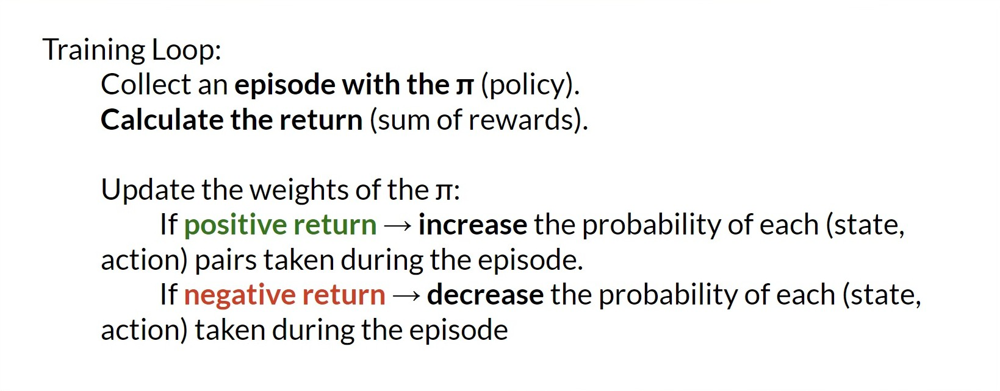
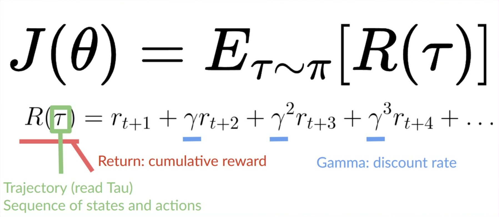
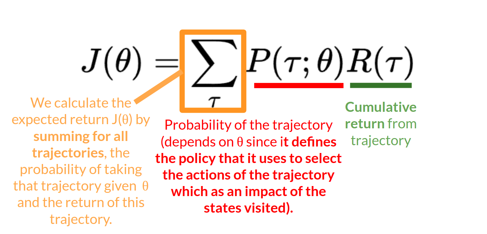
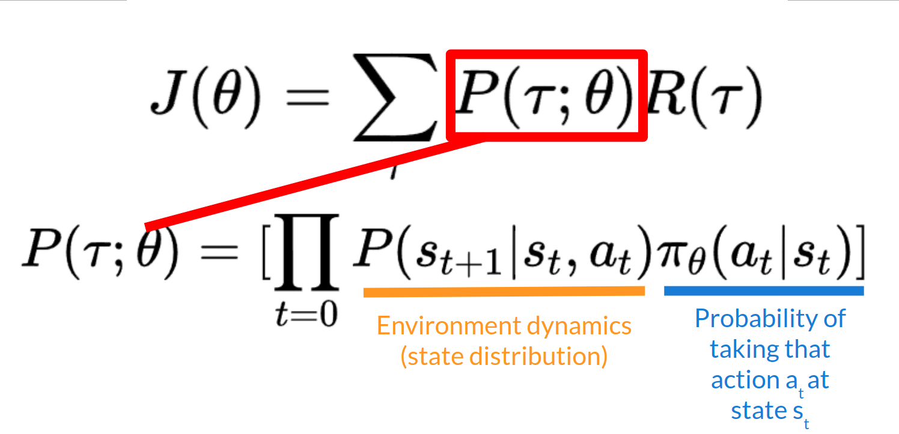
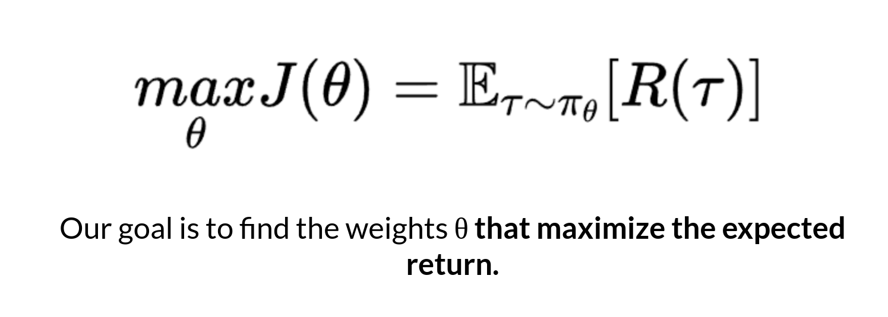

# Policy-Gradient Methods

## The Big Picture

The idea is that we have a _parameterized stochastic policy_. In our case, a neural network outputs a probability distribution over actions. The probability of taking each action is also called the _action preference_.

Our goal with policy-gradient is to **control the probability distribution of actions** by tuning the policy such that **good actions (that maximize the return) are sampled more frequently in the future.** Each time the agent interacts with the environment, we tweak the parameters such that good actions will be sampled more likely in the future.


But **how are we going to optimize the weights using the expected return**?


The idea is that we’re going to **let the agent interact during an episode**. And if we win the episode, we consider that each action taken was good and must be more sampled in the future since they lead to win.

So for each state-action pair, we want to increase the P(a s): the probability of taking that action at that state. Or decrease if we lost.

The Policy-gradient algorithm (simplified) looks like this:

<figure><figcaption></figcaption></figure>

***

We have our stochastic policy π which has a parameter θ. This π, given a state, **outputs a probability distribution of actions**.

Where πθ(atst) is the probability of the agent selecting action atat​ from state st​ given our policy.

**But how do we know if our policy is good?** We need to have a way to measure it. To know that, we define a score/objective function called J(θ).

## The objective function

The _objective function_ gives us the **performance of the agent** given a trajectory (state action sequence without considering reward (contrary to an episode)), and it outputs the _expected cumulative reward_.

<figure><figcaption></figcaption></figure>

Let’s give some more details on this formula:

### The _expected return_

The _expected return_ (also called expected cumulative reward), is the weighted average (where the weights are given by P(τ;θ) of all possible values that the return R(τ)can take).

<figure><figcaption></figcaption></figure>

### R(τ)

Return from an arbitrary trajectory. To take this quantity and use it to calculate the expected return, we need to multiply it by the probability of each possible trajectory.

### P(τ;θ)

Probability of each possible trajectory ττ (that probability depends on θθ since it defines the policy that it uses to select the actions of the trajectory which has an impact of the states visited).

<figure><figcaption></figcaption></figure>

### J(θ)

Expected return, we calculate it by summing for all trajectories, the probability of taking that trajectory given θ multiplied by the return of this trajectory.&#x20;

Our objective then is to maximize the expected cumulative reward by finding the θ that will output the best action probability distributions:

<figure><figcaption></figcaption></figure>
