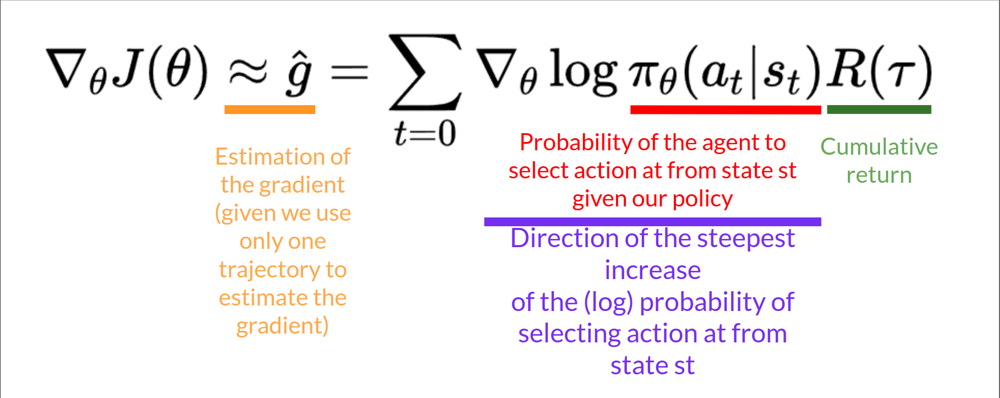

# The Reinforce Algorithm

The Reinforce algorithm, also called Monte-Carlo policy-gradient, is a policy-gradient algorithm that **uses an estimated return from an entire episode to update the policy parameter** θ:

In a loop:

* Use the policy $$\pi_{\theta}$$ to collect an episode $$\tau$$
* Use the episode to estimate the gradient $$\hat{g} = \nabla_{\theta} J(\theta)$$

<figure><figcaption></figcaption></figure>

* Update the weights of the policy: $$\theta \leftarrow \theta + \alpha \hat{g}$$

We can interpret this update as follows:

* $$\nabla_{\theta} \log \pi_{\theta}(a_t \mid s_t)$$ is the direction of steepest increase of the (log) probability of selecting action $$a_t$$ from state $$s_t$$. This tells us how we should change the weights of the policy if we want to increase/decrease the log probability of selecting action $$a_t$$  at state $$s_t$$.
* $$R(\tau)$$ is the scoring function:
  * If the return is high, it will **push up the probabilities** of the (state, action) combinations.
  * Otherwise, if the return is low, it will **push down the probabilities** of the (state, action) combinations.

We can also **collect multiple episodes (trajectories)** to estimate the gradient:

<figure><figcaption></figcaption></figure>
