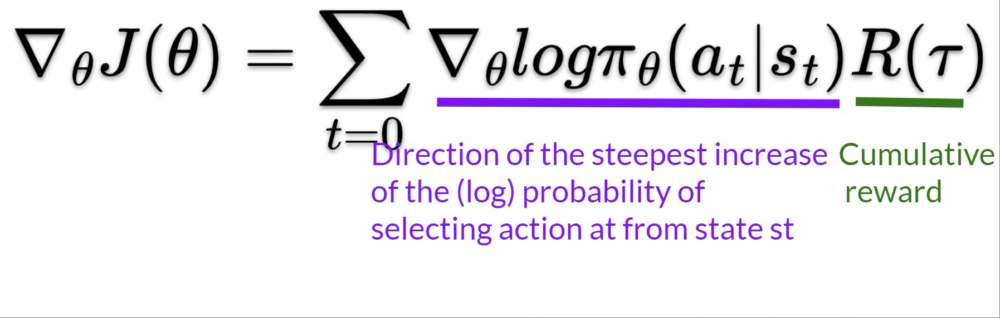

# The Problem of Variance in Reinforce

In Reinforce, we want to **increase the probability of actions in a trajectory proportionally to how high the return is.**

<figure><figcaption></figcaption></figure>

* If the **return is high**, we will **push up** the probabilities of the (state, action) combinations.
* Otherwise, if the **return is low**, it will **push down** the probabilities of the (state, action) combinations.

This return $$R(\tau)$$ is calculated using a _Monte-Carlo sampling_. We collect a trajectory and calculate the discounted return, **and use this score to increase or decrease the probability of every action taken in that trajectory**. If the return is good, all actions will be “reinforced” by increasing their likelihood of being taken.

$$R(\tau) = R_{t+1}+\gamma R_{t+2}+\gamma^2 R_{t+3} + ...$$&#x20;

The advantage of this method is that **it’s unbiased. Since we’re not estimating the return**, we use only the true return we obtain.

Given the stochasticity of the environment (random events during an episode) and stochasticity of the policy, **trajectories can lead to different returns, which can lead to high variance**. Consequently, the same starting state can lead to very different returns. Because of this, **the return starting at the same state can vary significantly across episodes**.

We can also **collect multiple episodes (trajectories)** to estimate the gradient:

<figure><figcaption></figcaption></figure>
