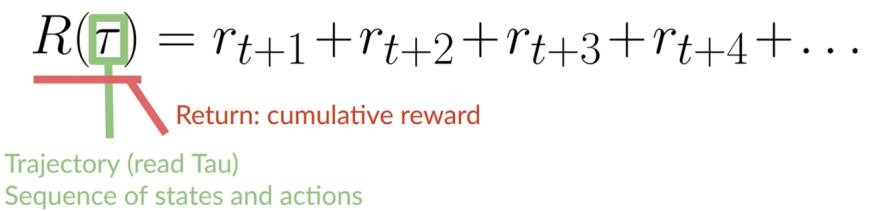
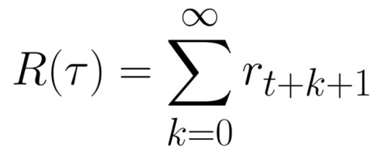

# Rewards and discounting

The reward is fundamental in RL because it’s the only feedback for the agent. Thanks to it, our agent knows if the action taken was good or not.

#### The cumulative reward at each time step t can be written as:

<figure><figcaption>
The cumulative reward equals the sum of all rewards in the sequence.
</figcaption></figure>

which is equivalent to:

&#x20;

<figure><figcaption>
The cumulative reward = rt+1 (rt+k+1 = rt+0+1 = rt+1)+ rt+2 (rt+k+1 = rt+1+1 = rt+2) + ...
</figcaption></figure>

However, in reality, we can’t just add them like that. The rewards that come sooner (at the beginning of the game) **are more likely to happen** since they are more predictable than the long-term future reward.

***

Let’s say your agent is this tiny mouse that can move one tile each time step, and your opponent is the cat (that can move too). The mouse’s goal is **to eat the maximum amount of cheese before being eaten by the cat.**

<figure><figcaption></figcaption></figure>

* As we can see in the diagram, it’s more probable to eat the cheese near us than the cheese close to **the cat** (the closer we are to the cat, the more dangerous it is).
* Consequently, **the reward near the cat, even if it is bigger (more cheese), will be more discounted** since we’re not really sure we’ll be able to eat it.

To discount the rewards, we proceed like this:

1. We define a discount rate called gamma. **It must be between 0 and 1**. Most of the time between **0.95 and 0.99**.
   1. The larger the gamma, the smaller the discount. This means our agent **cares more about the long-term reward.**
   2. On the other hand, the smaller the gamma, the bigger the discount. This means our **agent cares more about the short term reward (the nearest cheese).**
2. Then, each reward will be discounted by gamma to the exponent of the time step. As the time step increases, the cat gets closer to us, **so the future reward is less and less likely to happen.**

#### Our discounted expected cumulative reward is:

<figure><figcaption></figcaption></figure>
