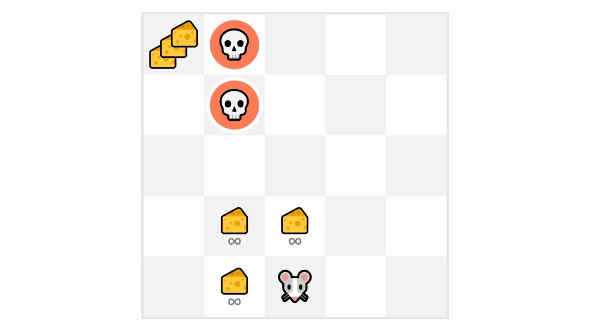
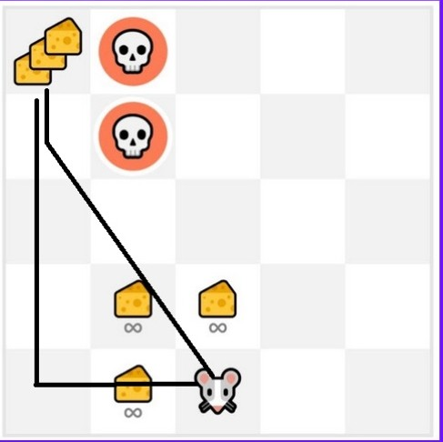

# The Exploration/Exploitation tradeoff

Remember, the goal of our RL agent is to maximize the expected cumulative reward. However, we can fall into a common trap.&#x20;

* Exploration is exploring the environment by trying random actions in order to find more information about the environment.
* Exploitation is exploiting known information to maximize the reward.

Let’s take an example:

<figure><figcaption></figcaption></figure>

In this game, our mouse can have an **infinite amount of small cheese** (+1 each). But at the top of the maze, there is a gigantic sum of cheese (+1000).

#### If we only focus on exploitation, our agent will never reach the gigantic sum of cheese. Instead, it will only exploit **the nearest source of rewards,** even if this source is small (exploitation).

<figure><figcaption></figcaption></figure>

#### But if our agent does a little bit of exploration, it can **discover the big reward** (the pile of big cheese).

<figure><figcaption></figcaption></figure>

This is what we call the exploration/exploitation trade-off. We need to balance how much we **explore the environment** and how much we **exploit what we know about the environment.**

Therefore, we must **define a rule that helps to handle this trade-off**.
