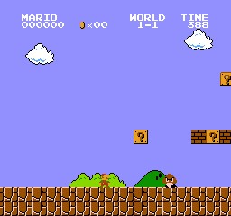

# Types of Tasks

A task is an **instance** of a Reinforcement Learning problem. We can have two types of tasks: **episodic** and **continuing**

## **Episodic task**

> In this case, we have a starting point and an ending point (**a terminal state**). **This creates an episode:** a list of States, Actions, Rewards, and new States.

<figure><figcaption></figcaption></figure>

For instance, think about Super Mario Bros: an episode begin at the launch of a new Mario Level and ends **when** you’re killed or you reached the end of the level.

## **Continuous task**

> These are tasks that continue forever (**no terminal state**). In this case, the agent must **learn how to choose the best actions and simultaneously interact with the environment.**

<figure><figcaption></figcaption></figure>

For instance, an agent that does automated stock trading. For this task, there is no starting point and terminal state. **The agent keeps running until we decide to stop it.**
