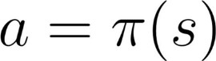
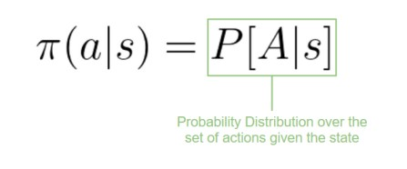

# Policy-Based Methods


Now that we learned the RL framework, how do we solve the RL problem? In other words, how do we build an RL agent that can **select the actions that maximize its expected cumulative reward?**&#x20;


## **The policy** π: the agent’s brain

The Policy π is the brain of our Agent, it’s the function that tells us what action to take given the state we are in. So it defines the agent’s behavior at a given time.

<figure><figcaption>
Think of policy as the brain of our agent, the function that will tell us the action to take given a state
</figcaption></figure>

This Policy is **the function we want to learn**, our goal is to find the optimal policy π\*, the policy that **maximizes expected return** when the agent acts according to it. We find this π\* **through training.**

There are two approaches to train our agent to find this optimal policy π\*:

* **Directly**, by teaching the agent to learn which **action to take**, given the current state: **Policy-Based Methods**.
* Indirectly, **teach the agent to learn w**hich state is more valuable and then take the action that **leads to the more valuable states**: Value-Based Methods.

***

### In Policy Based methods, **we learn a policy function directly**.

<figure><figcaption>
<em>As we can see here, the policy (deterministic) <strong>directly indicates the action to take for each step</strong></em>.
</figcaption></figure>

This function will define a mapping from each state to the best corresponding action. Alternatively, it could define a **probability distribution over the set of possible actions at that state** . We have two types of policies:

### _Deterministic_:

> a policy at  a given state will **always return the same action**

<figure><figcaption>
action = policy(state)
</figcaption></figure>

<figure><figcaption></figcaption></figure>

### _Stochastic_:

> outputs **a probability distribution over actions.**
>
>

<figure><figcaption>
policy(actions | state) = probability distribution over the set of actions given the current state
</figcaption></figure>

_Given an initial state, our stochastic policy will output probability distributions over the possible actions at that state._

<figure><figcaption></figcaption></figure>
