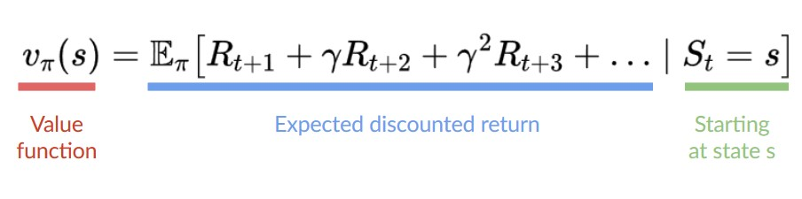

# Value-Based Methods

In value-based methods, instead of learning a policy function, we **learn a value function** that maps a state to the expected value **of being at that state.**

<figure><figcaption></figcaption></figure>

The value of a state is the **expected discounted return** the agent can get if it **starts in that state, and then acts according to our policy.**

***


But what does it mean to act according to our policy? After all, we don't have a policy in value-based methods since we train a value function and not a policy.


Here we see that our value function **defined values for each possible state.**

<figure><figcaption>
Thanks to our value function, at each step our policy will select the state with the biggest value defined by the value function: -7, then -6, then -5 (and so on) to attain the goal.
</figcaption></figure>

Since the policy is not trained/learned, **we need to specify its behavior.** For instance, if we want a policy that, given the value function, will take actions that always lead to the biggest reward, **we’ll create a Greedy Policy.**

In this case, you don’t train the policy: your policy **is just a simple pre-specified function** (for instance, the Greedy Policy) that uses the values given by the value-function to select its actions.

In value-based training, **finding an optimal value function (denoted Q\* or V\*) leads to having an optimal policy.**

Finding an optimal value function leads to having an optimal policy.

<figure><figcaption></figcaption></figure>

In fact, most of the time, in value-based methods, you’ll use **an Epsilon-Greedy Policy** that handles the exploration/exploitation trade-off.
