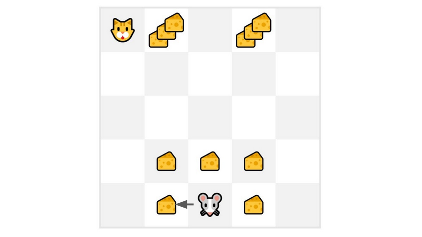

# Temporal Difference Learning: learning at each step

#### **Temporal Difference, on the other hand, waits for only one interaction (one step)** 𝑆𝑡**+1** to form a TD target and update 𝑉⟮𝑆𝑡⟯ using 𝑅𝑡**+1**​ and 𝛾∗𝑉⟮𝑆𝑡**+1**⟯.

#### The idea with **TD is to update the** 𝑉⟮𝑆𝑡⟯**at each step.**

#### But because we didn’t experience an entire episode, we don’t have 𝐺𝑡 (expected return). Instead, **we estimate** 𝐺𝑡 **by adding** 𝑅𝑡**+1 and the discounted value of the next state.**

#### This is called bootstrapping. It’s called this **because TD bases its update in part on an existing estimate** 𝑉⟮𝑆𝑡**+1**⟯ **and not a complete sample** 𝐺𝑡**​.**

## **TD approach:**

<figure><figcaption></figcaption></figure>


This method is called TD(0) or **one-step TD (update the value function after any individual step).**


## TD Approach:

At the end of one step (State, Actions, Rewards, and Next States):

* **We have** 𝑅𝑡**+1**​ and 𝑆𝑡**+1**
* **We update** 𝑉⟮𝑆𝑡⟯**:**
  * **we estimate** 𝐺𝑡 **by adding** 𝑅𝑡**+1and the discounted value of the next state.**
  * **TD Target:** 𝑅𝑡**+1**​ + 𝛾∗𝑉⟮𝑆𝑡**+1**⟯

Now we continue to interact with this environment with our updated value function. By running more and more steps, the agent will learn to play better and better.

***

### If we take an example:

<figure><figcaption></figcaption></figure>

* We initialize our value function **so that it returns 0 value for each state.**
* Our learning rate (lr) is 0.1 and our discount rate is 1 (= no discount).
* Our mouse begins to explore the environment and takes a random action: **going to the left**
* It gets a reward 𝑅𝑡**+1**​ = 1 since **it eats a piece of cheese**

We can now update 𝑉⟮𝑆**0**⟯:

* New 𝑉⟮𝑆**0**⟯=𝑉⟮𝑆**0**⟯+lr∗\[𝑅**1**​+𝛾∗𝑉⟮𝑆**0**⟯−𝑉⟮𝑆**0**⟯]
* New𝑉⟮𝑆**0**⟯=0+0.1∗\[1+1∗0–0]
* New𝑉⟮𝑆**0**⟯=0.1

So we just updated our value function for State 0.

Now we **continue to interact with this environment with our updated value function.**
