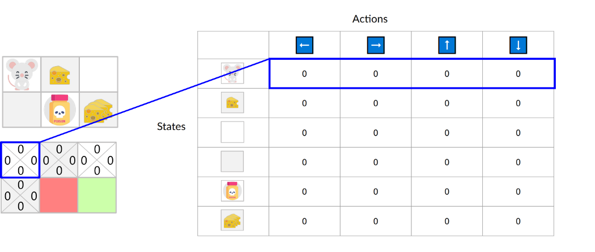
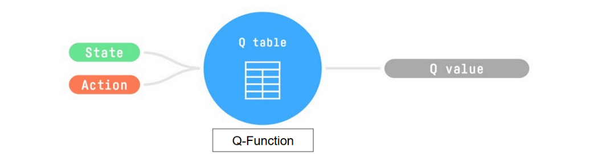

# Introducing Q-Learning

* _**Off-policy**_: the epsilon-greedy policy (acting policy), is different from the greedy policy that is used to select the best next-state action value to update our Q-value (updating policy).
* _**Value-based method**_: finds the optimal policy indirectly by training a value or action-value function that will tell us **the value of each state or each state-action pair.**
* _**TD approach**:_ **updates its action-value function at each step instead of at the end of the episode.**

**Q-Learning is the algorithm we use to train our Q-function**, an **action-value function** that determines the value of being at a particular state and taking a specific action at that state.

The **Q comes from “the Quality” (the value) of that action at that state.**

***

Let’s recap the difference between value and reward:


### **Value**

The _value of a state_, or a _state-action pair_ is the expected cumulative reward our agent gets if it starts at this state (or state-action pair) and then acts accordingly to its policy.



### Reward

The _reward_ is the **feedback I get from the environment** after performing an action at a state.


Internally, our Q-function is encoded by **a Q-table, a table where each cell corresponds to a state-action pair value.** Think of this Q-table as **the memory or cheat sheet of our Q-function.**

***

Let’s go through an example of a maze.

<figure><figcaption></figcaption></figure>

The Q-table is initialized. That’s why all values are = 0. This table **contains, for each state and action, the corresponding state-action values.**

<figure><figcaption></figcaption></figure>

Here we see that the **state-action value of the initial state and going up is 0:**

<figure><figcaption></figcaption></figure>

> #### So: the Q-function uses a Q-table **that has the value of each state-action pair.** Given a state and action, **our Q-function will search inside its Q-table to output the value.**

<figure><figcaption></figcaption></figure>

***

If we recap, _Q-Learning_ **is the RL algorithm that:**

* Trains a _Q-function_(an **action-value function**), which internally is a **Q-table that contains all the state-action pair values.**
* Given a state and action, our Q-function **will search its Q-table for the corresponding value.**
* When the training is done, **we have an optimal Q-function, which means we have optimal Q-table.**
* And if we **have an optimal Q-function**, we **have an optimal policy** since we **know the best action to take at each state.**

In the beginning, **our Q-table is useless since it gives arbitrary values for each state-action pair** (most of the time, we initialize the Q-table to 0).

As the agent **explores the environment and we update the Q-table, it will give us a better and better approximation** to the optimal policy.
