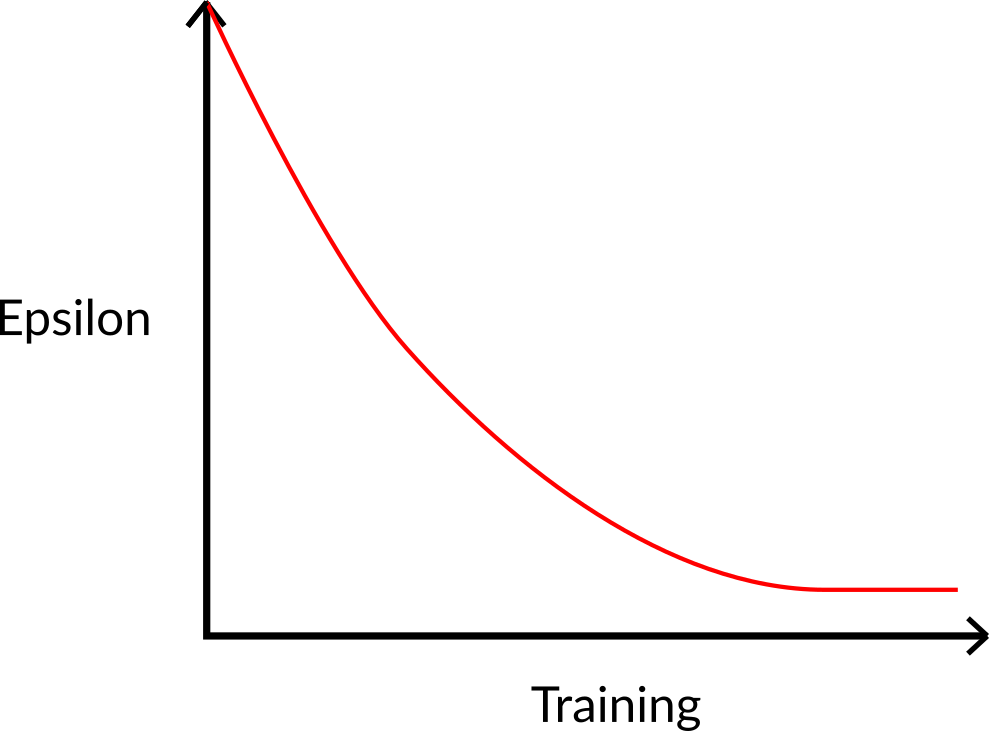

# The Q-Learning Algorithm

## Step 01: We initialize the Q-table

We need to initialize the Q-table for each state-action pair. **Most of the time, we initialize with values of 0.**

<figure><figcaption></figcaption></figure>

***

## Step 02: Choose an action using the epsilon-greedy strategy

The epsilon-greedy strategy is a policy that handles the exploration/exploitation trade-off.

The idea is that, with an initial value of ɛ = 1.0:

* _With probability 1 —ɛ_ : we do **exploitation** (aka our agent selects the action with the highest state-action pair value).
* With probability ɛ: **we do exploration** (trying random action).

<figure><figcaption></figcaption></figure>

At the beginning of the training, **the probability of doing exploration will be huge since ɛ is very high, so most of the time, we’ll explore.** But as the training goes on, and consequently our **Q-table gets better and better in its estimations, we progressively reduce the epsilon value** since we will need less and less exploration and more exploitation.

***

## Step 03: Perform action 𝐴𝑡, get reward 𝑅𝑡+1 and next state 𝑆𝑡+1

***

## Step 4: Update 𝑄⟮𝑆𝑡, 𝐴𝑡⟯

Remember that in TD Learning, we update our policy or value function (depending on the RL method we choose) **after one step of the interaction.**

To produce our TD target, **we used the immediate reward** 𝑅𝑡**+1​ plus the discounted value of the next state**, computed by finding the action that maximizes the current Q-function at the next state. (We call that bootstrap).

<figure><figcaption></figcaption></figure>

#### Therefore, our 𝑄⟮𝑆𝑡**,** 𝐴𝑡⟯ **update formula goes like this:**

<figure><figcaption></figcaption></figure>

#### This means that to update our 𝑄⟮𝑆𝑡**,** 𝐴𝑡⟯**:**

* We need 𝑆𝑡**,** 𝐴𝑡, 𝑅𝑡**+1**, 𝑆𝑡**+1**
* To update our Q-value at a given state-action pair, we use the TD target.

How do we form the TD target?

1. We obtain the reward after taking the action 𝑅𝑡**+1**
2. To get the **best state-action pair value** for the next state, we use a greedy policy to select the next best action. Note that this is not an epsilon-greedy policy, this will always take the action with the highest state-action value.

Then when the update of this Q-value is done, we start in a new state and select our action **using a epsilon-greedy policy again.**

**This is why we say that Q Learning is an off-policy algorithm.**
